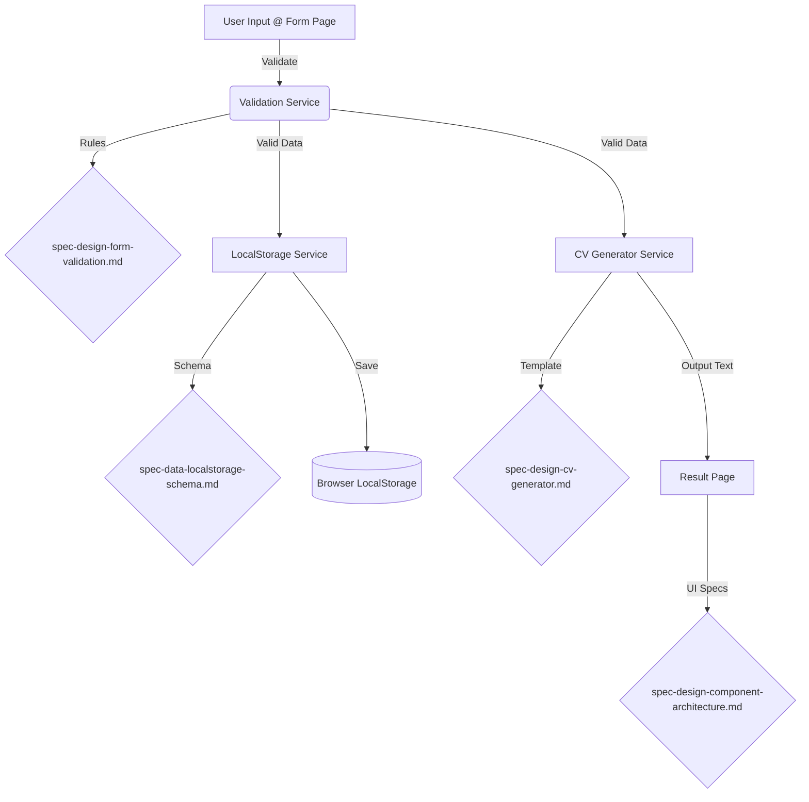

## Implementation Roadmap & Specification Guide

Dokumen ini berfungsi sebagai panduan langkah demi langkah untuk
mengimplementasikan aplikasi **Taaruf CV Kreator** berdasarkan dokumen
spesifikasi teknis yang telah disusun. Panduan ini dirancang agar mudah
dipahami oleh developer (manusia) maupun AI assistant.

## 📚 Bagian 1: Urutan Penggunaan Dokumen Spesifikasi

Untuk hasil pengembangan yang optimal dan terstruktur, ikuti urutan penggunaan
dokumen spesifikasi berikut ini. Jangan melompat ke tahap berikutnya sebelum
tahap sebelumnya dipahami atau diimplementasikan.

### 1️⃣ spec-data-localstorage-schema.md (Foundation)

**Status:** `PRIORITAS UTAMA`

- **Fungsi:** Mendefinisikan struktur data, tipe data, dan penyimpanan.
- **Kenapa Pertama?** Tanpa mengetahui bentuk data (`FormData`), kita tidak
  bisa membuat form UI atau validasi.
- **Output:** `src/services/localStorageService.js`, `src/types/formData.js`.

### 2️⃣ spec-design-component-architecture.md (Skeleton)

**Status:** `UI STRUCTURE`

- **Fungsi:** Mendefinisikan layout, routing, dan komponen visual.
- **Kenapa Kedua?** Kita butuh "wadah" (HTML/Views) untuk menampung input
  data pengguna.
- **Output:** `index.html`, `src/views/*.js`, `src/components/*.js`.

### 3️⃣ spec-design-form-validation.md (Logic Layer)

**Status:** `DATA INTEGRITY`

- **Fungsi:** Menambahkan aturan main pada form yang sudah dibuat.
- **Kenapa Ketiga?** Validasi hanya bisa dipasang setelah Form UI (Step 2)
  dan Data Schema (Step 1) ada.
- **Output:** `src/services/validationService.js`.

### 4️⃣ spec-design-cv-generator.md (Business Logic)

**Status:** `FINAL OUTPUT`

- **Fungsi:** Mengubah data valid menjadi teks CV yang rapi.
- **Kenapa Terakhir?** Generator butuh data yang sudah valid dan UI untuk
  menampilkan hasilnya.
- **Output:** `src/services/cvGeneratorService.js`.

---

## 🚀 Bagian 2: Implementation Roadmap (Step-by-Step)

Ikuti checklist ini secara berurutan.

### Phase 1: Project Setup & Data Layer

**Referensi:** `spec-data-localstorage-schema.md`

- [ ] **Setup Project**: Inisialisasi Vite, install Bootstrap 5, setup folder
  structure (`src/`, `public/`, `assets/`).
- [ ] **Define Types**: Buat definisi tipe data (JSDoc/TypeScript) untuk
  `FormData`, `DraftObject`, `HistoryObject` (Section 6).
- [ ] **Define Enums**: Implementasikan konstanta untuk Select Options
  (Section 5).
- [ ] **LocalStorage Service**: Buat service untuk handle CRUD operations
  (`saveDraft`, `loadDraft`, `saveHistory`, `getHistory`) dengan error
  handling (Section 3 & 4).

### Phase 2: UI Skeleton & Routing

**Referensi:** `spec-design-component-architecture.md`

- [ ] **Main Layout**: Buat `index.html` dengan Navbar dan container utama
  (Section 4.2).
- [ ] **Routing System**: Implementasikan hash-based router sederhana untuk
  menangani navigasi 8 halaman (Section 4.1).
- [ ] **Views Implementation**: Buat file skeleton untuk setiap halaman:
  - `Landing Page` (Section 5.1)
  - `Form Page` (Section 5.2) - *Hanya struktur HTML dulu*
  - `Preview Page` (Section 5.3)
  - `Result Page` (Section 5.4)
  - `Draft & History Pages` (Section 5.5 & 5.6)
  - `Doa & Settings Pages` (Section 5.7 & 5.8)
- [ ] **Shared Components**: Implementasikan `ModalConfirm`, `ToastNotification`,
  dan `DoaHaditsCard` (Section 6).
- [ ] **Doa & Hadits Content**: Implementasikan konten statis 13 doa/hadits dalam
  5 kategori sesuai PRD Section 3.6 (Section 5.7).

### Phase 3: Form Implementation & Validation

**Referensi:** `spec-design-form-validation.md`

- [ ] **Form Fields**: Lengkapi HTML `Form Page` dengan 49 input fields sesuai
  schema. Pastikan `name` attribute sesuai dengan `FormData` keys.
- [ ] **Validation Service**: Buat fungsi validasi untuk mengecek constraints
  (required, minLength, regex) (Section 4).
- [ ] **Real-time Validation**: Pasang event listeners (`blur`, `input`) untuk
  memberikan visual feedback (border merah/hijau) (Section 3.1).
- [ ] **Conditional Logic**: Implementasikan logic untuk show/hide field
  berdasarkan `jenisKelamin` dan `statusPernikahan` (Section 6).
- [ ] **Form Submission**: Handle tombol "Preview CV" untuk memvalidasi seluruh
  form sebelum navigasi (Section 3.2).

### Phase 4: CV Generator Logic

**Referensi:** `spec-design-cv-generator.md`

- [ ] **Helper Functions**: Buat fungsi `formatDate`, `formatEmpty`, dll
  (Section 6).
- [ ] **Generator Service**: Implementasikan fungsi `generateCV(data)` yang
  me-return string template (Section 7).
- [ ] **Template Mapping**: Pastikan semua 49 field ter-mapping dengan benar ke
  dalam template text (Section 4 & 8).
- [ ] **Result View Integration**: Pasang output generator ke `<textarea>` di
  `Result Page`.
- [ ] **Copy to Clipboard**: Implementasikan fitur copy text di `Result Page`.

### Phase 5: Integration & Polish

**Referensi:** Semua Dokumen

- [ ] **Connect Drafts**: Sambungkan tombol "Simpan Draft" di Form Page ke
  LocalStorage Service.
- [ ] **Connect History**: Sambungkan tombol "Selesai" di Result Page ke
  LocalStorage Service.
- [ ] **Load Draft**: Implementasikan fitur load data dari Draft Page kembali ke
  Form Page.
- [ ] **Settings Page**: Implementasikan konten Settings (Tentang Aplikasi, Info
  Developer, Tools & Teknologi, Versi, Kebijakan Privasi) sesuai PRD Section 3.7.
- [ ] **Clear Data Feature**: Implementasikan fitur reset/clear localStorage di
  Settings Page (Danger Zone).
- [ ] **Final Testing**: Verifikasi semua Acceptance Criteria (AC) di setiap
  dokumen spesifikasi dan User Stories di PRD.

---

## 🔗 Bagian 3: Cross-Reference Map

Peta hubungan antar dokumen untuk memahami aliran data.

---

---

## 📋 Bagian 4: Peta Fitur PRD ke Implementation

Mapping antara fitur di PRD dengan fase implementasi:

| Fitur PRD (Section 3.x)  | Phase Implementation | File Spec Terkait                                                     |
| ------------------------ | -------------------- | --------------------------------------------------------------------- |
| 3.1 Form Input Interface | Phase 2, 3           | spec-design-component-architecture.md, spec-design-form-validation.md |
| 3.2 Fitur Preview        | Phase 2              | spec-design-component-architecture.md (Section 5.3)                   |
| 3.3 Generator Teks       | Phase 4              | spec-design-cv-generator.md                                           |
| 3.4 Fitur Draft          | Phase 1, 5           | spec-data-localstorage-schema.md (Section 6.2)                        |
| 3.5 Fitur History        | Phase 1, 5           | spec-data-localstorage-schema.md (Section 6.3)                        |
| 3.6 Doa & Hadits         | Phase 2              | spec-design-component-architecture.md (Section 5.7)                   |
| 3.7 Settings & About     | Phase 2, 5           | spec-design-component-architecture.md (Section 5.8)                   |
| 3.8 User Utilities       | Phase 2, 4, 5        | Semua spec                                                            |

---

## 📝 Catatan untuk AI Assistant

Jika Anda (AI) diminta untuk mengimplementasikan fitur, ikuti protokol ini:

1. **Identifikasi Fitur**: Tentukan fitur apa yang diminta user dan mapping ke
   PRD Section 3.x.
2. **Cek Dokumen**: Lihat "Bagian 1" dan "Bagian 4" untuk menentukan dokumen
   spec dan fase mana yang relevan.
3. **Baca PRD**: Gunakan tool `read_file` untuk membaca requirement dari PRD
   terlebih dahulu.
4. **Baca Spec**: Gunakan tool `read_file` untuk membaca detail spesifikasi
   yang relevan (terutama bagian Schema dan Acceptance Criteria).
5. **Implementasi**: Tulis kode yang mematuhi batasan (Constraints) dan aturan
   (Requirements) di spec serta memenuhi User Stories di PRD.
6. **Verifikasi**: Pastikan kode memenuhi Acceptance Criteria di spec DAN User
   Stories di PRD.
